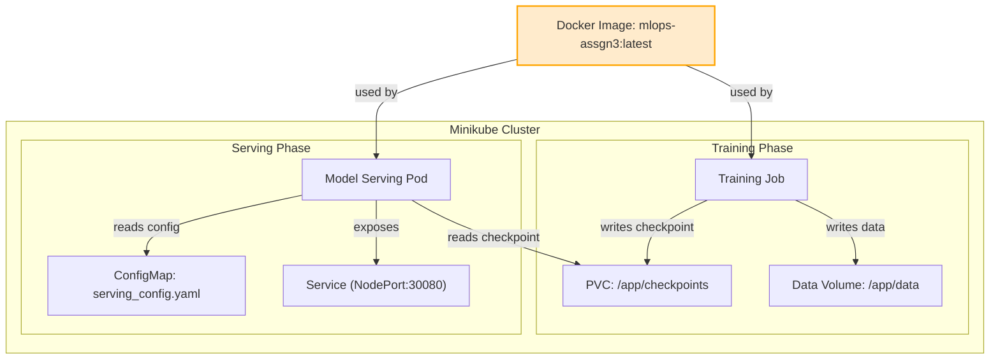

# MLOps Assignment – CIFAR‑10 Classifier

## Overview
This project implements a complete MLOps pipeline for training and serving a CIFAR‑10 image classifier. It follows the assignment rubric and runs entirely inside Docker using a **single Docker image** for both training and serving. Docker‑Compose orchestrates the workflow locally, and Kubernetes manifests are provided for deployment to a cluster.

## Architecture


## Quick Start (Docker Compose)
```bash
# Build the image and start training (runs once and exits)
docker compose up --build training

# After training finishes, start the serving API
docker compose up -d serving

# Verify the service
curl http://localhost:8080/health   # should return {"status":"healthy"}
```
## Quick Start (Kubernetes)

```bash
# Apply all manifests with Kustomize
kubectl apply -k k8s/

# Verify the deployment
kubectl get pods -l app=model-serving -n ml-training

# Port‑forward the NodePort to your local machine (optional)
kubectl port-forward svc/model-serving 8000:8080 -n ml-training
# Then test:
curl http://127.0.0.1:8000/health
```

> **Note**: The manifests use **Kustomize** (`k8s/kustomization.yaml`) to set labels, namespace, and resource ordering. If you modify resources, run `kubectl apply -k k8s/` again to rebuild the overlay.

## Repository Structure
```
mlops-pytorch-pipeline/
├─ .gitignore
├─ Dockerfile               # single image
├─ docker-compose.yml
├─ requirements.txt
├─ setup.sh
├─ README.md                # you are reading it :) 
├─ src/
│  ├─ dataset.py           # data loader utilities
│  ├─ model.py             # model definition
│  ├─ train.py             # training script
│  └─ serve.py             # FastAPI serving app
├─ configs/
│  ├─ training_config.yaml
│  └─ serving_config.yaml
└─ k8s/                     # Kubernetes manifests
```

## Linting & CI
The CI pipeline runs `flake8` and `black` on every push/PR. See `.github/workflows/ci.yml`.
