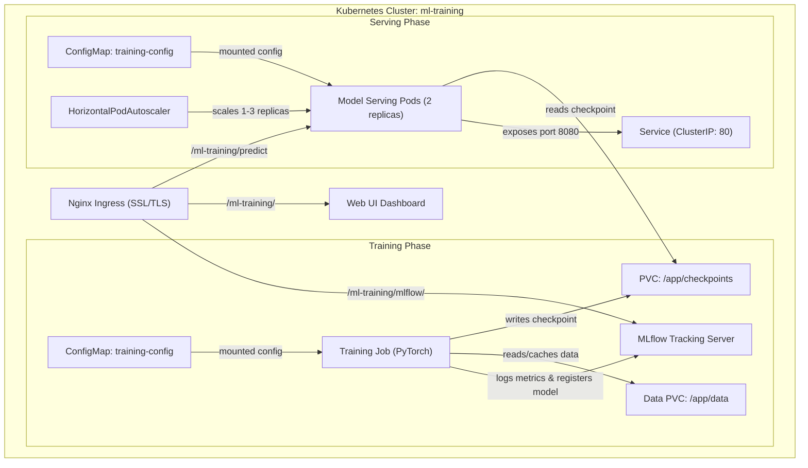

# MLOps Assignment – CIFAR‑10 Classifier


## Overview
This project implements a complete MLOps pipeline for training and serving a CIFAR‑10 image classifier using PyTorch, Docker, and Kubernetes. It supports multi-stage container builds, reproducible training with checkpoint persistence, and scalable inference with health probes and HPA autoscaling.

---

## 🌐 Live Cluster Deployment

The pipeline is actively deployed and accessible on the production Kubernetes cluster:

| Service | URL | Description |
| :--- | :--- | :--- |
| **Interactive Web UI** | [https://opssynergy.isroot.in/ml-training/](https://opssynergy.isroot.in/ml-training/) | Glassmorphic drag-and-drop dashboard for image classification |
| **Prediction Endpoint** | `POST https://opssynergy.isroot.in/ml-training/predict` | FastAPI inference endpoint returning class probabilities |
| **Health Check** | [https://opssynergy.isroot.in/ml-training/health](https://opssynergy.isroot.in/ml-training/health) | Liveness / readiness probe endpoint (`{"status": "healthy"}`) |
| **MLflow Experiment Tracking** | [https://opssynergy.isroot.in/ml-training/mlflow/](https://opssynergy.isroot.in/ml-training/mlflow/) | Real-time metric curves, parameters, and model registry |

---

## Architecture Diagram



---

## Transfer Learning Strategy
The pipeline leverages **Transfer Learning & Fine-Tuning** using a pre-trained **ResNet-18** model initialized with ImageNet weights (`weights="DEFAULT"`) to achieve high accuracy and rapid convergence on CIFAR-10:
* **Architecture (`src/model.py`)**: Torchvision ResNet-18 with the final fully-connected linear layer adapted from 1000 ImageNet classes to 10 CIFAR-10 classes (`nn.Linear(512, 10)`), with full network fine-tuning.
* **Data Preprocessing & Augmentation (`src/dataset.py`)**:
  * Resizes input images to $64 \times 64$ to optimize transfer learning feature representations while maintaining fast CPU compute throughput.
  * Applies ImageNet normalization (`mean=[0.485, 0.456, 0.406]`, `std=[0.229, 0.224, 0.225]`).
  * Augmentations: Random Horizontal Flip, Random Rotation (15°), and Color Jitter (brightness/contrast/saturation).
* **Optimization & Scheduling (`src/train.py`)**:
  * Optimizer: **SGD** with momentum (`momentum=0.9`, `weight_decay=5e-4`, `lr=0.1`).
  * Learning Rate Scheduler: **Cosine Annealing** (`CosineAnnealingLR`) smoothly decaying from `0.1` down to `0.001` across epochs, delivering >77% accuracy in Epoch 1 and >85%+ in subsequent epochs.
* **Experiment Tracking & Model Registry**: Integrated with **MLflow** (`http://mlflow:5000` / `/ml-training/mlflow/`) to track loss, accuracy curves, and automatically register the best epoch checkpoint.

---

## Quick Start (Docker)

```bash
# 1. Build training and serving images
docker build -f docker/Dockerfile.train -t mlops-train:v1 .
docker build -f docker/Dockerfile.serve -t mlops-serve:v1 .

# 2. Run containerized training with mounted volumes
docker run --rm \
  -v $(pwd)/data:/app/data \
  -v $(pwd)/checkpoints:/app/checkpoints \
  mlops-train:v1

# 3. Run model serving
docker run --rm -p 8080:8080 \
  -v $(pwd)/checkpoints:/app/checkpoints \
  mlops-serve:v1

# 4. Test prediction endpoint
curl -X POST http://localhost:8080/predict \
  -F "image=@test_image.png"
```

---

## Quick Start (Kubernetes)

```bash
# 1. Deploy all manifests using Kustomize
kubectl apply -k k8s/

# 2. Or apply manifests individually
kubectl apply -f k8s/namespace.yaml
kubectl apply -f k8s/configmap.yaml
kubectl apply -f k8s/pvc-data.yaml
kubectl apply -f k8s/pvc-checkpoints.yaml
kubectl apply -f k8s/training-job.yaml
kubectl apply -f k8s/serving-deployment.yaml
kubectl apply -f k8s/serving-service.yaml
kubectl apply -f k8s/hpa.yaml

# 3. Port-forward for local testing (if not using Ingress)
kubectl port-forward svc/model-serving 8080:80 -n ml-training

# 4. Test health and predictions
curl http://localhost:8080/health
curl -X POST http://localhost:8080/predict -F "image=@test_image.png"
```

---

## Repository Structure
```
mlops-pytorch-pipeline/
├── README.md
├── .gitignore
├── .github/
│   └── workflows/
│       ├── ci.yml
│       └── docker-build.yml
├── src/
│   ├── train.py
│   ├── model.py
│   ├── dataset.py
│   └── serve.py
├── configs/
│   ├── training_config.yaml
│   └── serving_config.yaml
├── docker/
│   ├── Dockerfile.train
│   └── Dockerfile.serve
├── web-ui/
│   └── index.html
├── k8s/
│   ├── namespace.yaml
│   ├── training-job.yaml
│   ├── serving-deployment.yaml
│   ├── serving-service.yaml
│   ├── mlflow-deployment.yaml
│   ├── mlflow-service.yaml
│   ├── web-ui-deployment.yaml
│   ├── web-ui-configmap.yaml
│   ├── ingress.yaml
│   ├── configmap.yaml
│   ├── hpa.yaml
│   ├── pvc-data.yaml
│   ├── pvc-checkpoints.yaml
│   └── kustomization.yaml
├── requirements/
│   ├── train.txt
│   └── serve.txt
└── tests/
    └── test_model.py
```

---

## Linting & CI
The CI pipeline automatically runs `black`, `flake8`, and `pytest` on every push/PR to validate code formatting and test coverage. See [.github/workflows/ci.yml](file:///.github/workflows/ci.yml).
